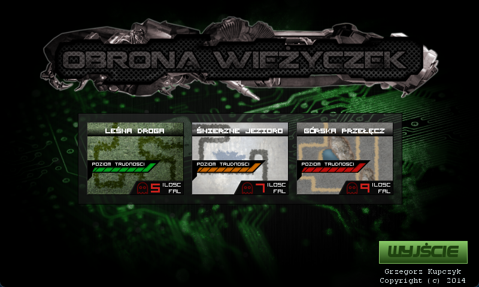
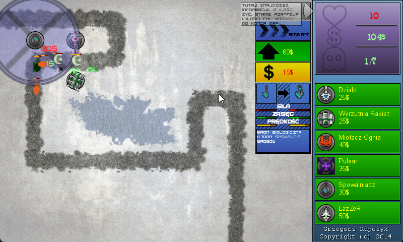
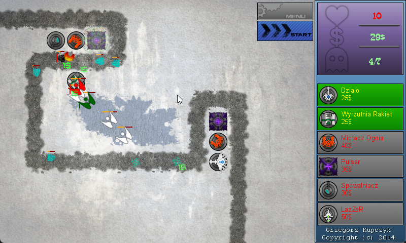
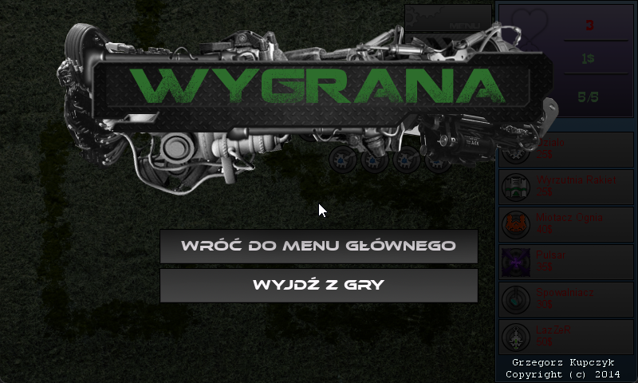

> imported 2014

# Tower Defense
Classic tower defense game I created in elementary shool, where every graphic asset is made by me. The game used old [XNA game engine](https://en.wikipedia.org/wiki/Microsoft_XNA), but while the framework is dead nowdays, I ported it to [MonoGame](https://www.monogame.net/), before uploading sources to the Internet.

